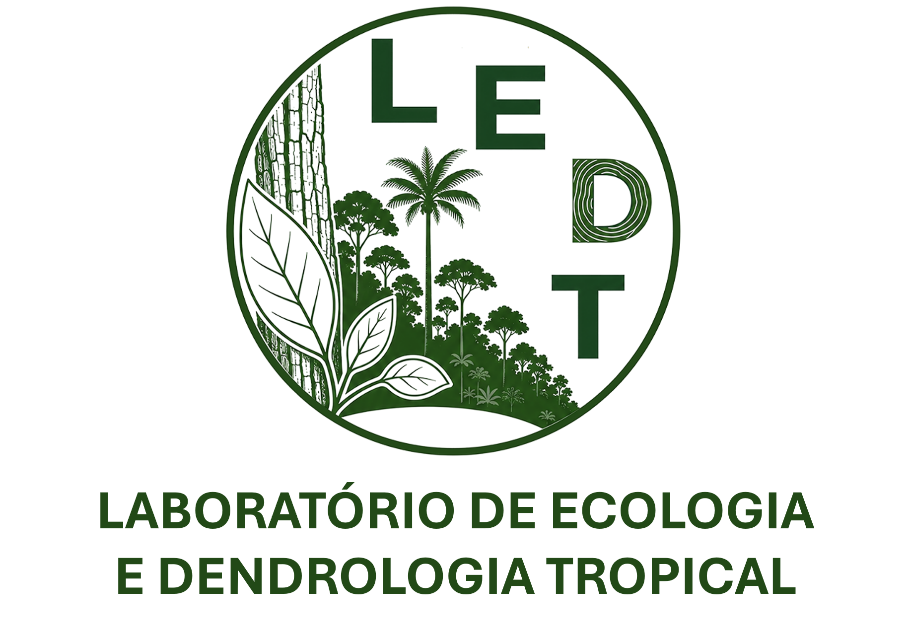
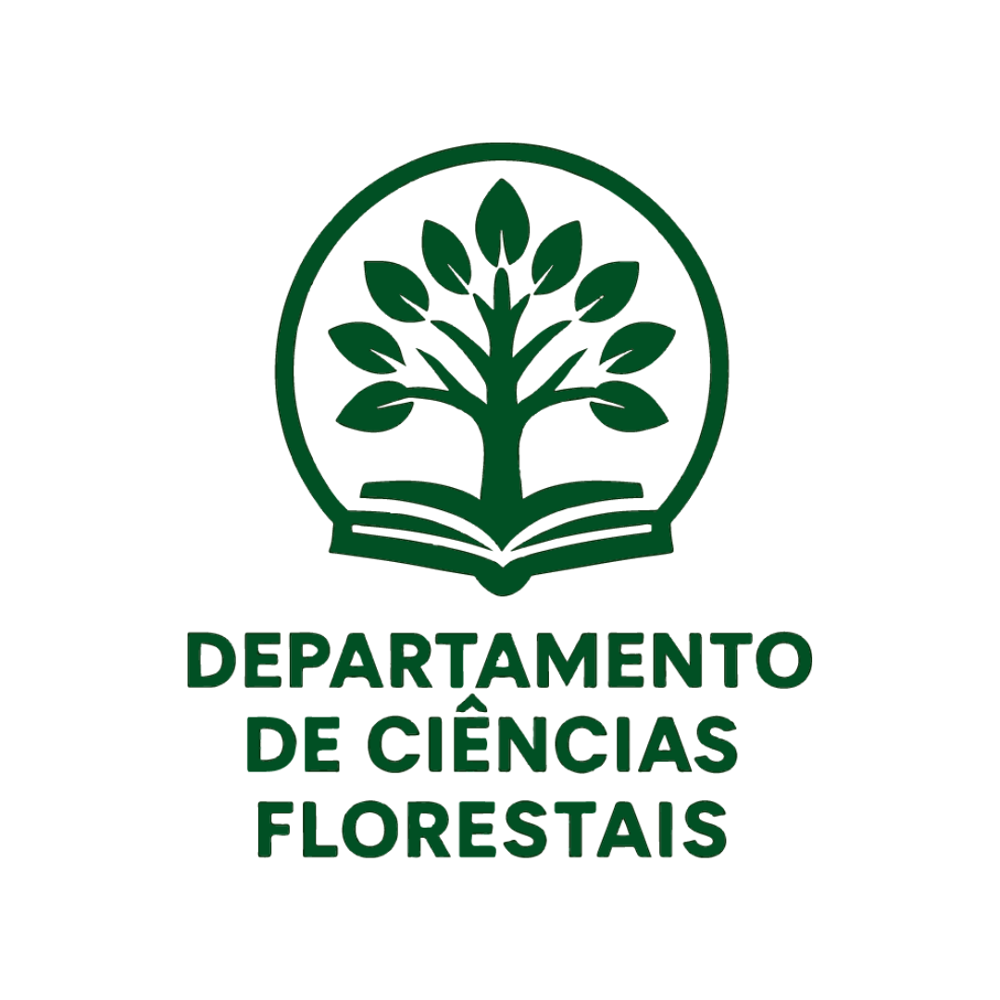
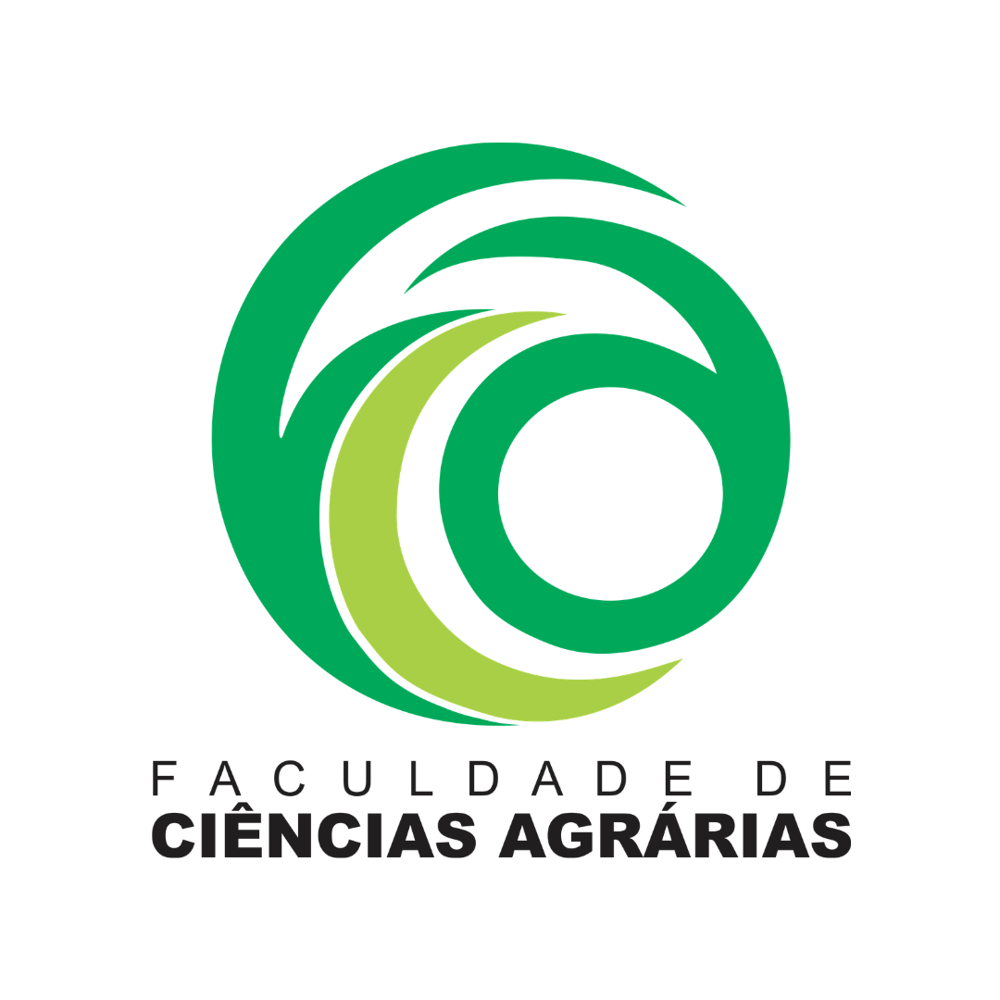
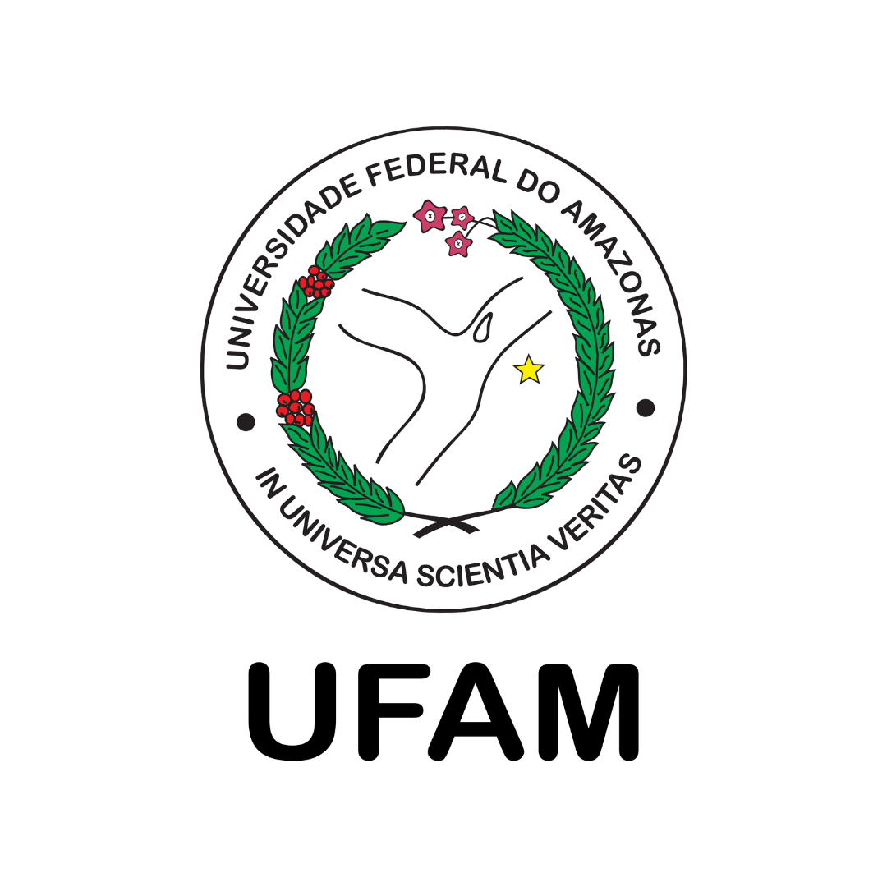

No **Laboratório de Ecologia Tropical e Dendrologia (LEDT)**, estudamos a diversidade, a ecologia, a taxonomia e as características funcionais das árvores amazônicas. Combinamos trabalho de campo, coleções de herbário, espectroscopia, monitoramento ecológico e abordagens analíticas integrativas para investigar a identificação de espécies, padrões de biodiversidade, características funcionais e as respostas das florestas tropicais às mudanças climáticas.

Com sede na Universidade Federal do Amazonas (UFAM), em Manaus, Brasil, nosso grupo colabora com redes de pesquisa nacionais e internacionais para promover a compreensão, a documentação e a conservação da biodiversidade amazônica.

{width="1828"}

#### O LEDT é apoiado por

::: {.columns}

::: {.column width="33%"}
{fig-align="center" width="150"}
:::

::: {.column width="33%"}
{fig-align="center" width="150"}
:::

::: {.column width="33%"}
{fig-align="center" width="150"}
:::

:::