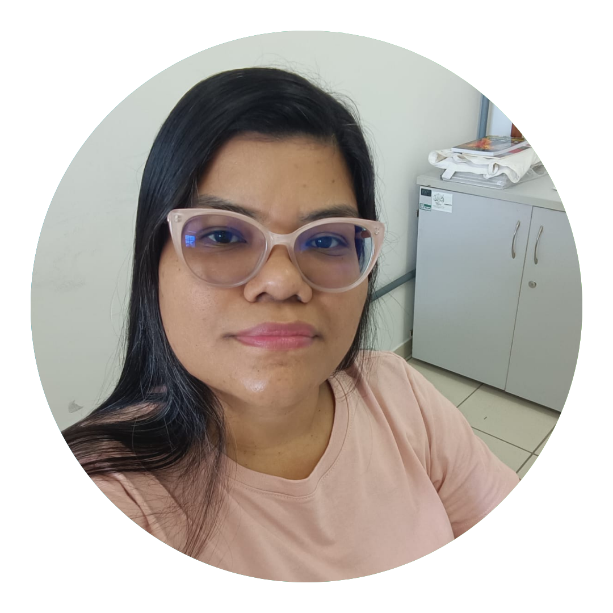
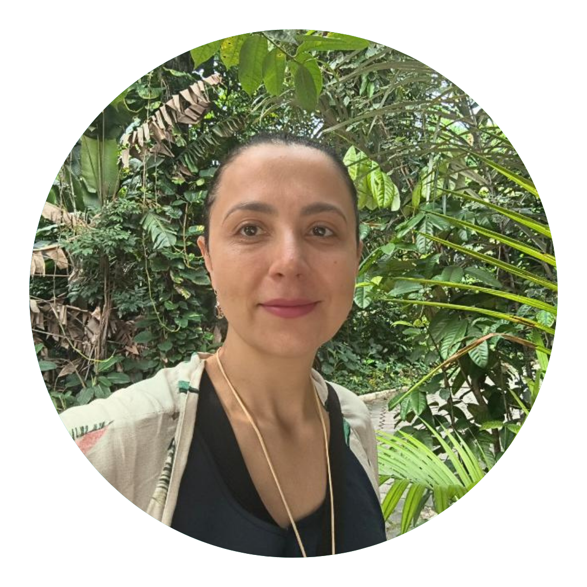
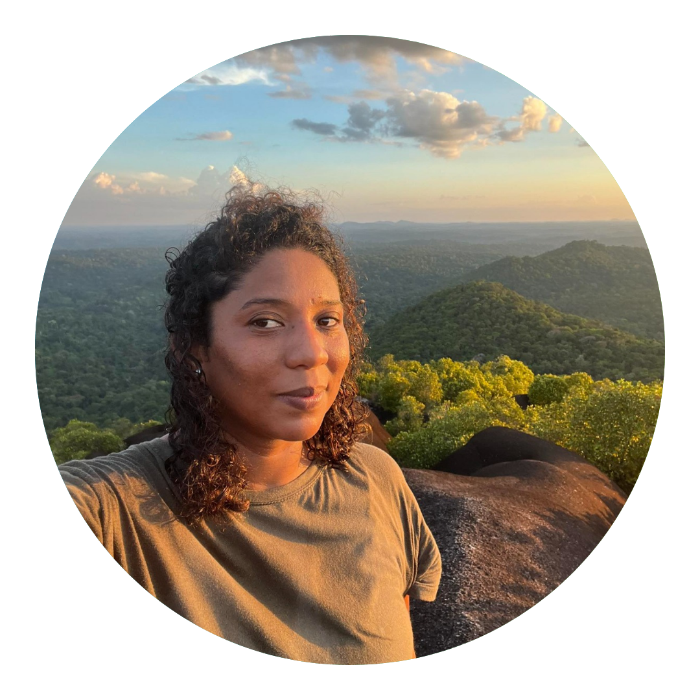
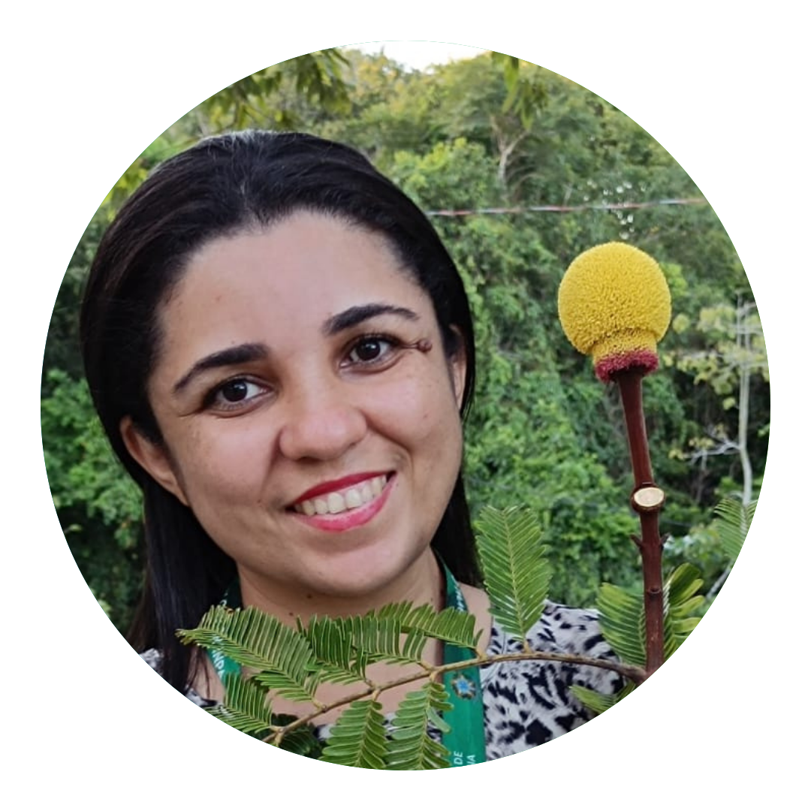
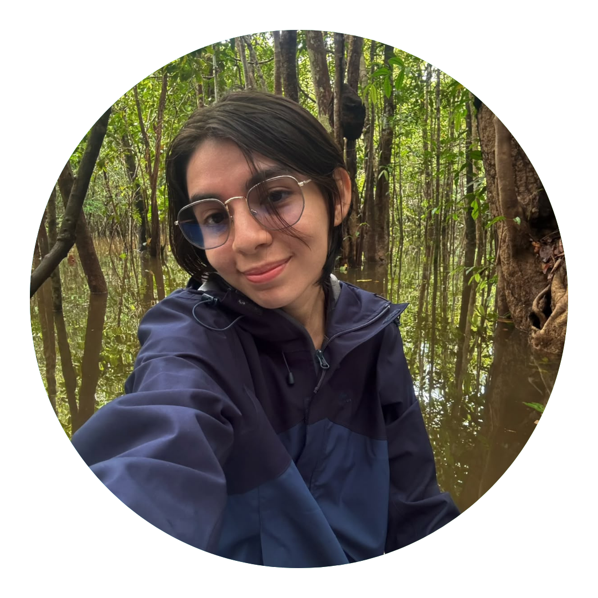
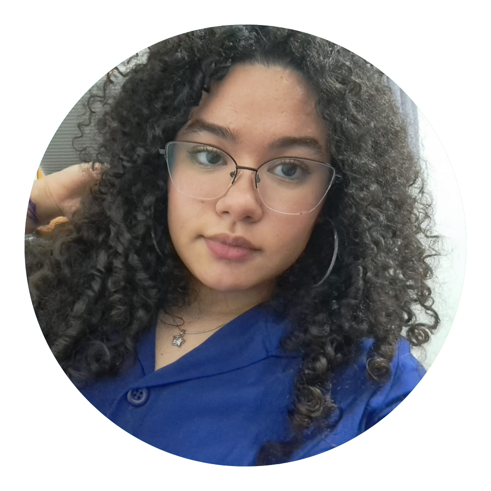
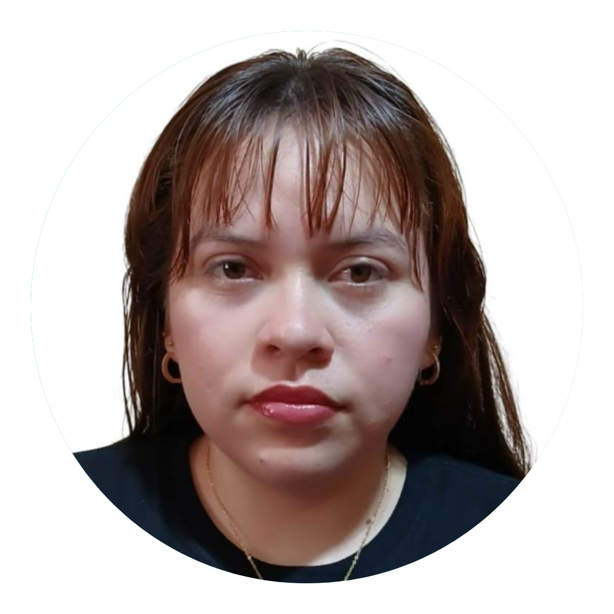
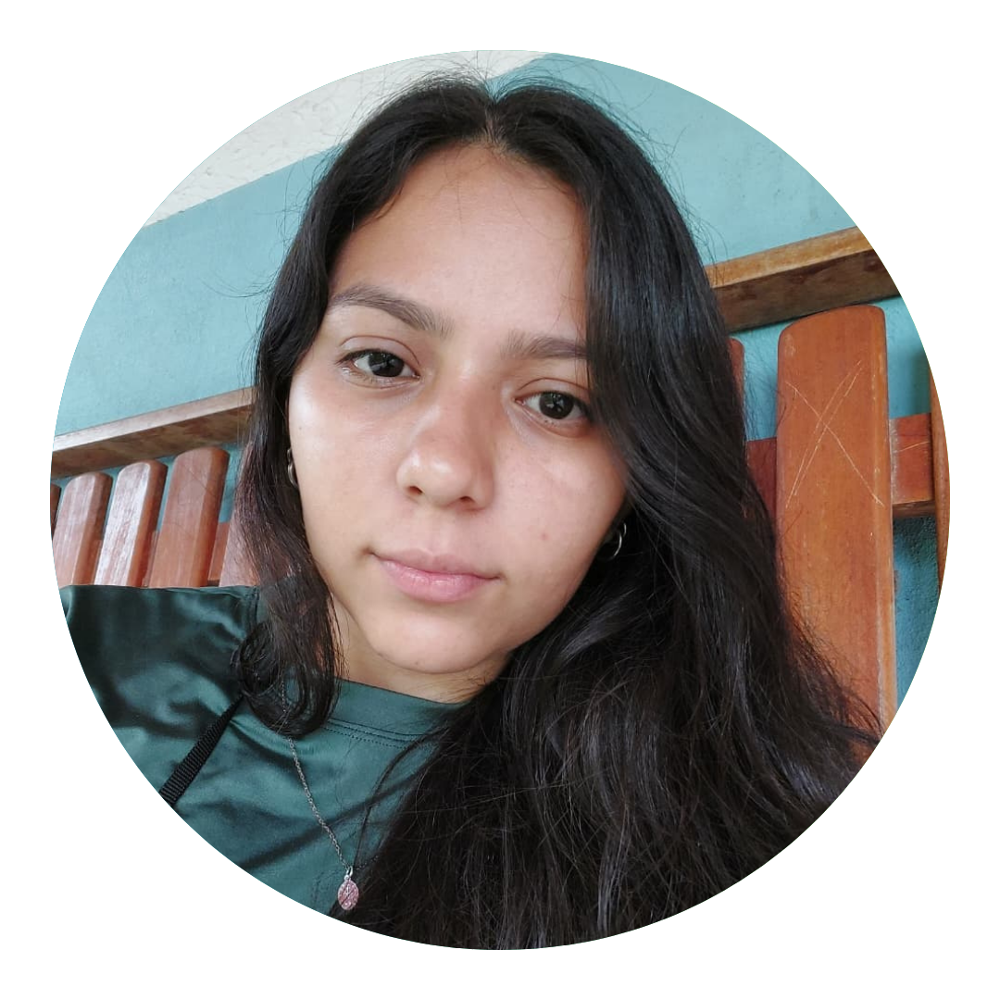

### Coordenação

:::::: columns
::: {.column width="25%"}
{.img-fluid .rounded-circle width="180"}
:::

:::: {.column width="75%"}
#### Caroline C. Vasconcelos (ela/dela)

**Professora Assistente, Dra. \| Departamento de Ciências Florestais**\
Universidade Federal do Amazonas (UFAM)

Linhas de pesquisa: Taxonomia integrativa e sistemática; Flora arbórea da Amazônia; Sapotaceae; Digitalização espectral; Herbários; Ecologia Florestal

::: person-links

<a href="http://lattes.cnpq.br/1535461703335857" title=""> {alt="" width="22"} </a>

<a href="https://www.researchgate.net/profile/Caroline-Vasconcelos" title=""> {alt="" width="22"} </a>

:::
::::
::::::

### Pesquisadores colaboradores

:::::: columns
::: {.column width="25%"}
{.img-fluid .rounded-circle width="180"}
:::

:::: {.column width="75%"}
#### Flávia Machado Durgante (ela/dela)

**Pesquisadora, Dra. \| Coordenação de Dinâmica Ambiental**\
Instituto Nacional de Pesquisas da Amazônia (INPA)

Linhas de pesquisa: Ecologia e Manejo Florestal

::: person-links

<a href="http://lattes.cnpq.br/9866263113578229" title=""> {alt="" width="22"} </a>

<a href="https://www.researchgate.net/profile/Flavia-Durgante" title=""> {alt="" width="22"} </a>

:::
::::
::::::

:::::: columns
::: {.column width="25%"}
{.img-fluid .rounded-circle width="180"}
:::

:::: {.column width="75%"}
#### Yêda Maria Boaventura Corrêa Arruda (ela/dela)

**Professora Associada I, Dra. \| Departamento de Biologia do Instituto de Ciências Biológicas**\
Universidade Federal do Amazonas (UFAM)

Linhas de pesquisa: sementes florestais; espécies florestais; Amazônia; espécies nativas; dormência; silvicultura urbana; gestão e planejamento urbano

::: person-links

<a href="http://lattes.cnpq.br/0546454617072726" title=""> {alt="" width="22"} </a>

<a href="https://www.researchgate.net/profile/Yeda-Arruda" title=""> {alt="" width="22"} </a>

:::
::::
::::::

:::::: columns
::: {.column width="25%"}
{.img-fluid .rounded-circle width="180"}
:::

:::: {.column width="75%"}
#### Gabrielly Guabiraba Ribeiro (ela/dela)

**Doutoranda \| Programa de Pós-Graduação em Botânica**\
Instituto de Pesquisas Jardim Botânico do Rio de Janeiro (JBRJ)

Linhas de pesquisa: Taxonomia e biogeografia; *Ormosia* (Leguminosae); Ecologia florestal

::: person-links

<a href="http://lattes.cnpq.br/4435352680317467" title=""> {alt="" width="22"} </a>

<a href="" title=""> {alt="" width="22"} </a>

:::
::::
::::::

:::::: columns
::: {.column width="25%"}
{.img-fluid .rounded-circle width="180"}
:::

:::: {.column width="75%"}
#### Samyra Ramos Chaves (ela/dela)

**Pesquisadora bolsista, Dra. \| Grupo MAUA**\
Instituto Nacional de Pesquisas da Amazônia (INPA)

Linhas de pesquisa: Biologia reprodutiva; *Parkia* (Leguminosae); Digitalização espectral; Herbários

::: person-links

<a href="http://lattes.cnpq.br/1333559162162849" title=""> {alt="" width="22"} </a>

<a href="https://www.researchgate.net/profile/Samyra-Chaves" title=""> {alt="" width="22"} </a>

:::
::::
::::::

:::::: columns
::: {.column width="25%"}
{.img-fluid .rounded-circle width="180"}
:::

:::: {.column width="75%"}
#### Kaio Cesar Marinho da Cunha (ele/dele)

**Pesquisador bolsista, Me. \| Grupo MAUA**\
Instituto Nacional de Pesquisas da Amazônia (INPA)

Linhas de pesquisa: Taxonomia integrativa e sistemática; Sapotaceae; Digitalização espectral; Herbários

::: person-links

<a href="http://lattes.cnpq.br/2664299098538335" title=""> {alt="" width="22"} </a>

<a href="https://www.researchgate.net/profile/Kaio-Da-Cunha" title=""> {alt="" width="22"} </a>

:::
::::
::::::

### Alunos

#### Pós-graduação

:::::: columns
::: {.column width="25%"}
{.img-fluid .rounded-circle width="180"}
:::

:::: {.column width="75%"}
##### Túlio Alex Martins da Silva (ele/dele)

**Doutorando \| Programa de Pós-Graduação em Botânica**\
Instituto Nacional de Pesquisas da Amazônia (INPA)

Linhas de pesquisa: Taxonomia e sistemática; Biologia reprodutiva; Euphorbiaceae

::: person-links

<a href="http://lattes.cnpq.br/7937040274378072" title=""> {alt="" width="22"} </a>

<a href="https://www.researchgate.net/profile/Tulio-Martins-Da-Silva" title=""> {alt="" width="22"} </a>

:::
::::
::::::

:::::: columns
::: {.column width="25%"}
{.img-fluid .rounded-circle width="180"}
:::

:::: {.column width="75%"}
##### Maria Clara A. M. de O. Ramos Ferro (ela/dela)

**Mestranda \| Programa de Pós-Graduação em Botânica**\
Instituto Nacional de Pesquisas da Amazônia (INPA)

Linhas de pesquisa: Espectroscopia NIR como ferramenta para a taxonomia botânica

::: person-links

<a href="http://lattes.cnpq.br/8490385946321507" title=""> {alt="" width="22"} </a>

<a href="" title=""> {alt="" width="22"} </a>

:::
::::
::::::

#### Iniciação científica (voluntários)

:::::: columns
::: {.column width="25%"}
{.img-fluid .rounded-circle width="180"}
:::

:::: {.column width="75%"}
##### Ana Graciela Oliveira Mayo (ela/dela)

**Graduanda \| Engenharia Florestal**\
Universidade Federal do Amazonas (UFAM)

Linhas de pesquisa: Espectroscopia aplicada à identificação de árvores comerciais; Herbários

::: person-links

<a href="https://lattes.cnpq.br/1877297301223493" title=""> {alt="" width="22"} </a>

<a href="" title=""> {alt="" width="22"} </a>

:::
::::
::::::

:::::: columns
::: {.column width="25%"}
{.img-fluid .rounded-circle width="180"}
:::

:::: {.column width="75%"}
##### Aynê Carolyne Silva Sá (ela/dela)

**Graduanda \| Engenharia Florestal**\
Universidade Federal do Amazonas (UFAM)

Linhas de pesquisa: Ecologia e Dendrologia; trilha didática; espécies florestais

::: person-links

<a href="http://lattes.cnpq.br/0238654391031764" title=""> {alt="" width="22"} </a>

<a href="" title=""> {alt="" width="22"} </a>

:::
::::
::::::

:::::: columns
::: {.column width="25%"}
{.img-fluid .rounded-circle width="180"}
:::

:::: {.column width="75%"}
##### André Luiz da Silva Melo (ele/dele)

**Graduando \| Engenharia Florestal**\
Universidade Federal do Amazonas (UFAM)

Linhas de pesquisa: Dendrologia

::: person-links

<a href="http://lattes.cnpq.br/7903256480417228" title=""> {alt="" width="22"} </a>

<a href="" title=""> {alt="" width="22"} </a>

:::
::::
::::::

:::::: columns
::: {.column width="25%"}
{.img-fluid .rounded-circle width="180"}
:::

:::: {.column width="75%"}
##### Heyder Loureiro Pinagé Neto (ele/dele)

**Graduando \| Engenharia Florestal**\
Universidade Federal do Amazonas (UFAM)

Linhas de pesquisa: Dendrologia

::: person-links

<a href="" title=""> {alt="" width="22"} </a>

<a href="" title=""> {alt="" width="22"} </a>

:::
::::
::::::

:::::: columns
::: {.column width="25%"}
{.img-fluid .rounded-circle width="180"}
:::

:::: {.column width="75%"}
##### Vitor Hugo Santos Silva (ele/dele)

**Graduando \| Engenharia Florestal**\
Universidade Federal do Amazonas (UFAM)

Linhas de pesquisa: Dendrologia

::: person-links

<a href="" title=""> {alt="" width="22"} </a>

<a href="" title=""> {alt="" width="22"} </a>

:::
::::
::::::

#### Iniciação científica (bolsistas)

:::::: columns
::: {.column width="25%"}
{.img-fluid .rounded-circle width="180"}
:::

:::: {.column width="75%"}
##### Eliandra Rodrigues Ferreira (ela/dela)

**Graduanda \| Ciências Biológicas**\
Universidade Federal do Amazonas (UFAM)

Linhas de pesquisa: Espectroscopia aplicada à identificação de plantas; Herbários; Meliaceae; Fabaceae; Espécies CITES

::: person-links

<a href="" title="http://lattes.cnpq.br/3358526069960413"> {alt="" width="22"} </a>

<a href="" title=""> {alt="" width="22"} </a>

:::
::::
::::::

:::::: columns
::: {.column width="25%"}
{.img-fluid .rounded-circle width="180"}
:::

:::: {.column width="75%"}
##### Yasmin Jéssica G. Guedes (ela/dela)

**Graduanda \| Licenciatura em Ciências Biológicas**\
Universidade Federal do Amazonas (UFAM)

Linhas de pesquisa: Espectroscopia aplicada à identificação de plantas; Herbários; Bignoniaceae; Espécies CITES

::: person-links

<a href="http://lattes.cnpq.br/7129000327997949" title=""> {alt="" width="22"} </a>

<a href="" title=""> {alt="" width="22"} </a>

:::
::::
::::::

:::::: columns
::: {.column width="25%"}
{.img-fluid .rounded-circle width="180"}
:::

:::: {.column width="75%"}
##### Cassia Sousa Ataide (ela/dela)

**Graduanda \| Engenharia da Computação**\
Universidade Federal do Amazonas (UFAM)

Linhas de pesquisa: Espectroscopia aplicada à identificação de plantas; Herbários; *Ecclinusa*; *Machine learning*

::: person-links

<a href="http://lattes.cnpq.br/6974374662437947" title=""> {alt="" width="22"} </a>

<a href="" title=""> {alt="" width="22"} </a>

:::
::::
::::::
